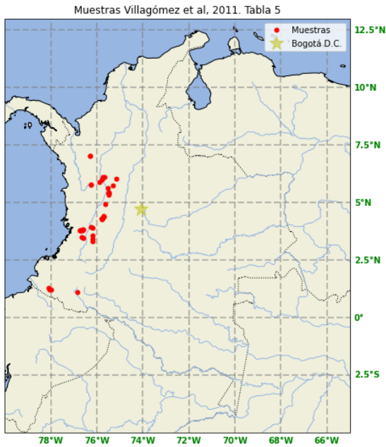
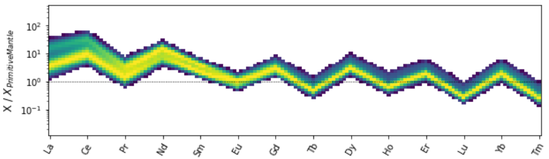

##Villagómez et al, 2011 - Geochronology, geochemistry and tectonic evolution of the Western and Central cordilleras of Colombia

This papers makes a terrane-based hypothesis to explain the current geological status of Colombia's western and central Cordilleras.

	<em>Samples used in table 5 in the paper.</em>

	<em>Spidergram density plot of REE in samples given in table 5.</em>

