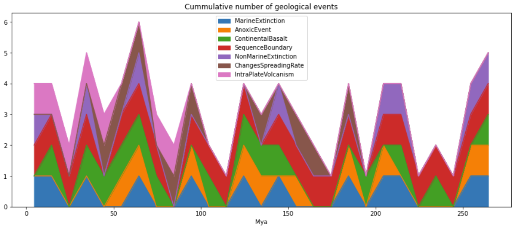

##Rampino et al, 2021 - A pulse of the Earth: A 27.5-Myr underlying cycle in coordinated geological events over the last 260 My

This papers concludes that there exists a pulse of 27.5 mya in geological events (extinctions, anoxia, intraplate vulcanism). This is done using 89 well dated major geological events over the last 260 Mya and applying Fourier analysis to the dates; the authors suggest the cycles may be related to  activity pulses in the earth's interior produce by plate tectonic dynamics or may also derive from astronomical cycles.

####Cummulative events accross the geological Periods analyzed