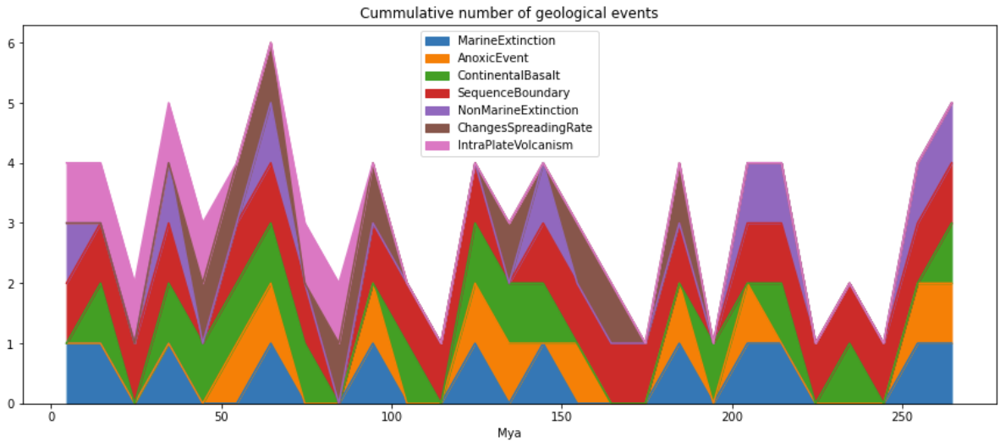

### Geological Menagerie

A repo where I place code for papers, blogs, conferences, etc of geological interest

Folders:

- PulsesEarth

Paper by Rampino et al, 2021 (A pulse of the Earth: A 27.5-Myr underlying cycle in coordinated geological events over the last 260 Myr) which talks about a supossed cycle of 27Ma in the geological record. I try to implement the analysis using python.

	<em>Cummulative events accross the geological Periods analyzed</em>

- CordillerasDiagrams

Data visualization of information provided by Villagomez et al, 2011 (Geochronology, geochemistry and tectonic evolution of the Western and Central cordilleras of Colombia) who uses a complex hypothesis of terrane accretion to explain the present geological status of western Colombia.

- RegressionDeposit

Trying to reproduce Chung, 1980 application of regression analysis to VMS deposits in Newfoundland
